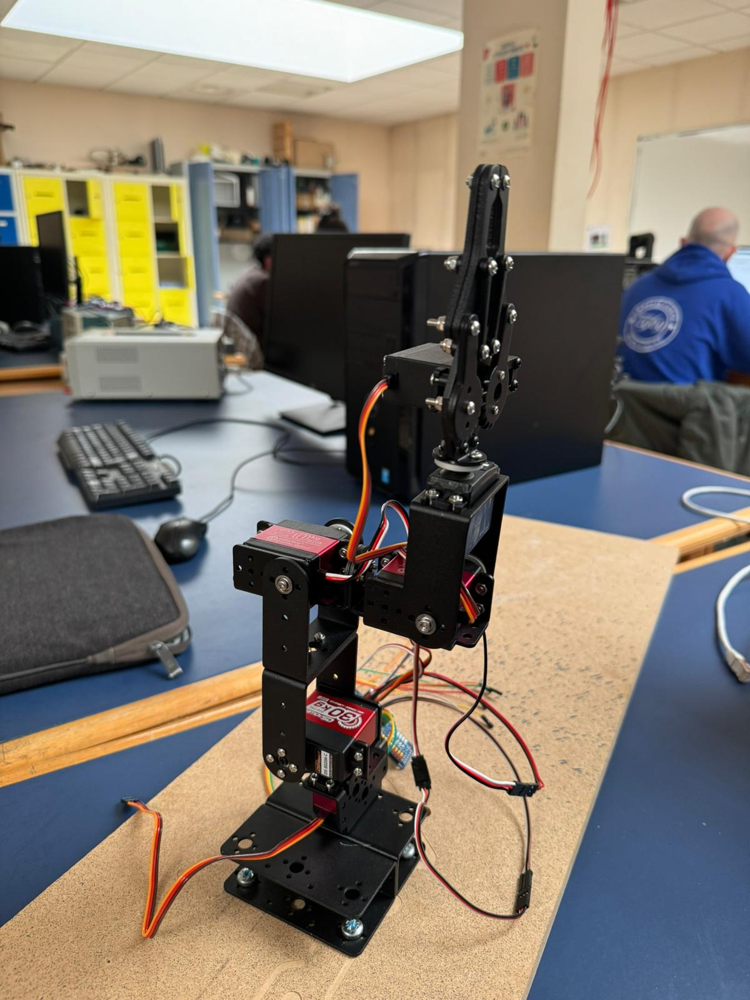
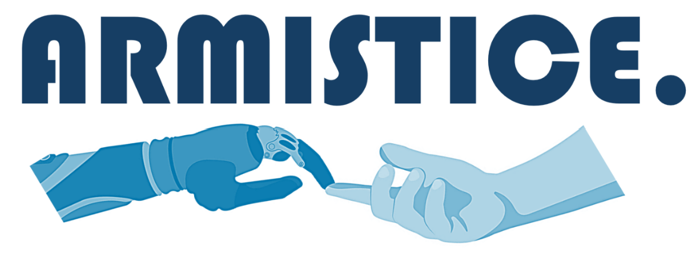

<div align="center">
  

  # 🤖 Armistice - Teleoperated Medical Robotic Arm
  
  **Assisting medical professionals in disaster and conflict zones via remote control and AI-powered vision.**
</div>

---

## 📝 Overview
**Armistice** is a 6-axis, teleoperated robotic arm specifically designed to demonstrate the feasibility of remote medical intervention in areas impacted by natural disasters or active conflict. By coupling robust mechatronics with an AI-equipped vision system, a surgeon or doctor can interact with the environment, run diagnostics, and deliver critical care from a secure location while the robot operates in the danger zone.

> **Note**: This repository contains the algorithms, kinematic models, interface code, and core intelligence developed as part of a 4-person engineering project (Groupe 4). 

## ✨ Key Features
- **Teleoperation from Anywhere**: Full control mapped intuitively to a custom 5" touchscreen interface (Freemove) or a PlayStation 4 DualShock 4 controller. 
- **High-Precision Inverse Kinematics**: Custom 3D inverse kinematics engine calculated in Python, transforming raw `(x, y, z)` coordinate targets into precise joint angles (`Theta 1, 2, 3`) on the fly.
- **AI-Powered Vision & Diagnostics**: Integrated HD webcam runs through a Python AI pipeline to automatically identify specific objects or medical anomalies, ensuring the operator focuses on operations, while the bot handles localization.
- **Heavy-Duty & Resilient Build**: A fully-metal, modular chassis powered by high-torque DS3218 pro servos (up to 30 kg/cm) to support heavy surgical tools—a massive step up from standard plastic hobby setups.
- **Plug-and-Play Architecture**: Powered entirely by a single Raspberry Pi 4 that orchestrates PWM signals through a PCA9685 driver, ensuring smooth, lag-free operations across all 6 axes.

## 💻 Tech Stack
- **Hardware Architecture**: Raspberry Pi 4B+, PCA9685 PWM Driver
- **Actuation**: 6x DS3218 Pro Servos (20kg, 25kg, 30kg configurations)
- **Vision**: Microsoft 720p HD Camera
- **Software**: Python 3 (Control logic, Inverse Kinematics, GUI, AI Vision Analysis)
- **Input interfaces**: DualShock 4 (via `ds4drv`), Freemove 5" Touchscreen

## 📁 Repository Structure
```
armistice-github-repo/
├── src/
│   ├── ERA.py               # Inverse Kinematics mathematical engine
│   ├── main.py              # Main execution loop
│   ├── test_interface.py    # Touchscreen GUI integration
│   ├── brouillon.py         # Sandbox & testing logic
│   └── kinematics.py        # Forward/Inverse Kinematics classes
├── media/
│   ├── robot.jpg            # Actual photo of the deployed arm
│   ├── Arm.png              # Kinematic blueprint reference
│   └── robot_redbull.mp4    # Real-world demonstration video
└── README.md
```

## 🏗️ Architecture & Kinematics
### Inverse Kinematics (IK)
The robot's spatial orientation is driven by an IK algorithm that takes a Cartesian objective `(X, Y, Z)` and computes the required joint angles (`θ1, θ2, θ3`) in real-time. This is essential for keeping the end-effector (gripper/tool) stable regardless of the base orientation.

<div align="center">
  
</div>

### Control Loop
1. The **User** interacts via the Touchscreen UI or PS4 Controller.
2. The **Raspberry Pi 4** translates these inputs, combining them with AI tracking data from the Webcam.
3. The integrated IK solver computes the optimal positioning.
4. The **PCA9685 Driver** manages power delivery and exact positioning for all 6 servos, ensuring millimetric precision.

## 🚀 Impact & Future Scope
The initial prototype proves that a low-cost, highly capable medical support robot can be deployed with minimal infrastructure. Future iterations could integrate fiber-optic connections for zero-latency transatlantic surgery and advanced haptic feedback for the operator.

---
*Created by Groupe 4: Grégoire BOULEY, Julien LE-BRIS, Alan MOREAU, Arthur SOGHOYAN*
