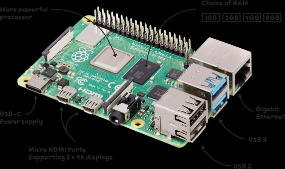
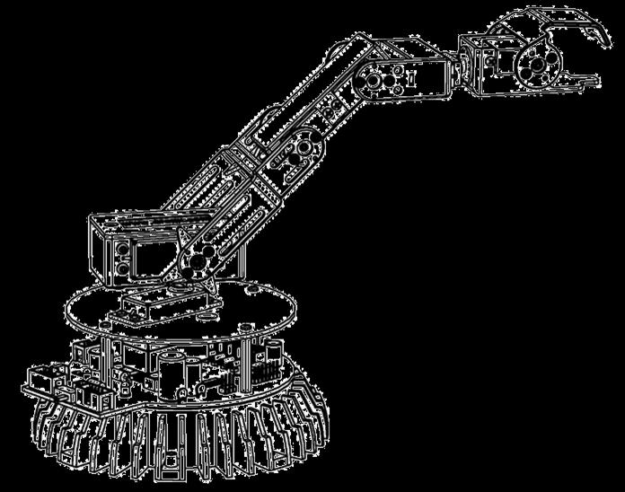
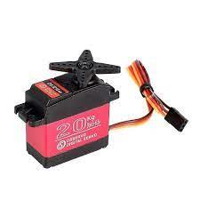
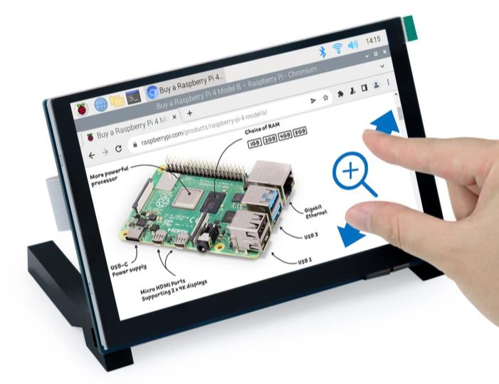
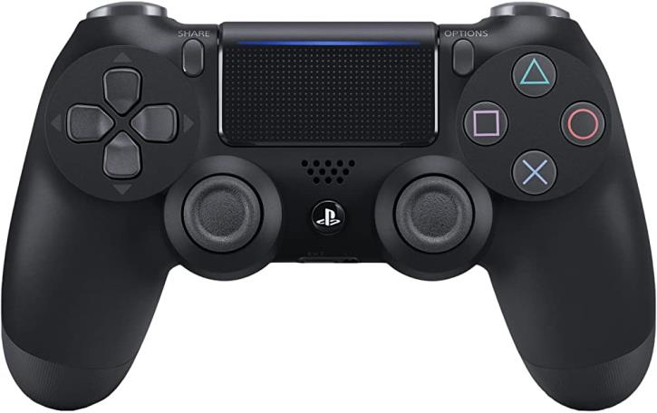
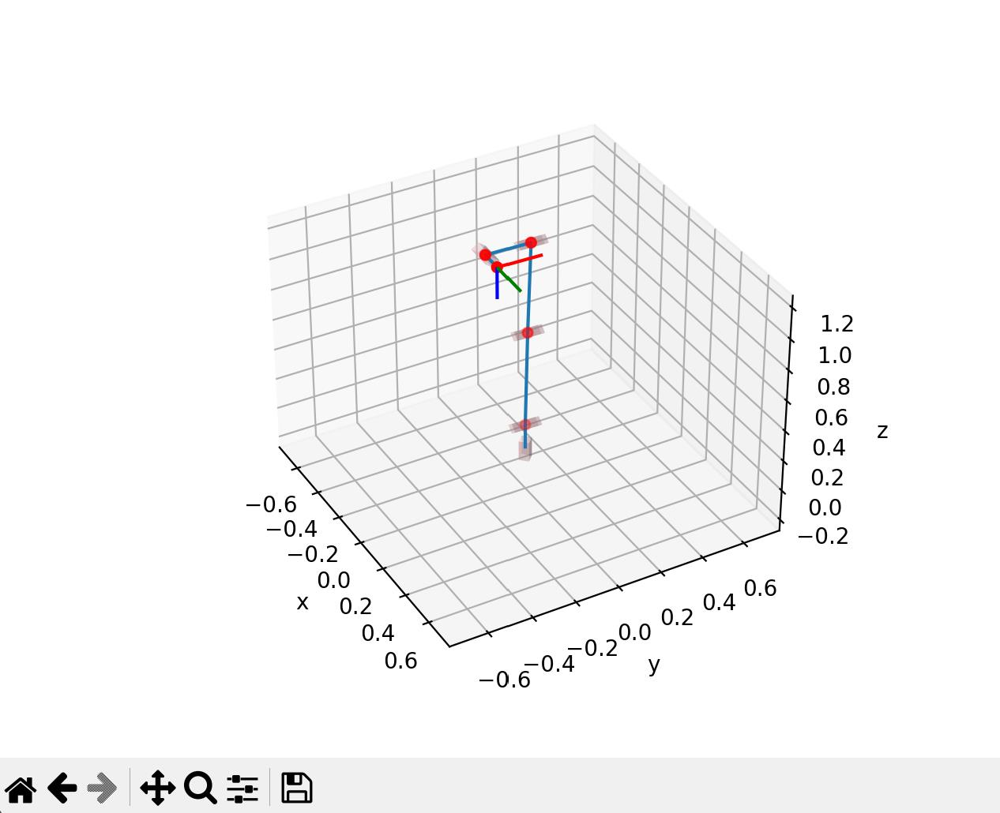
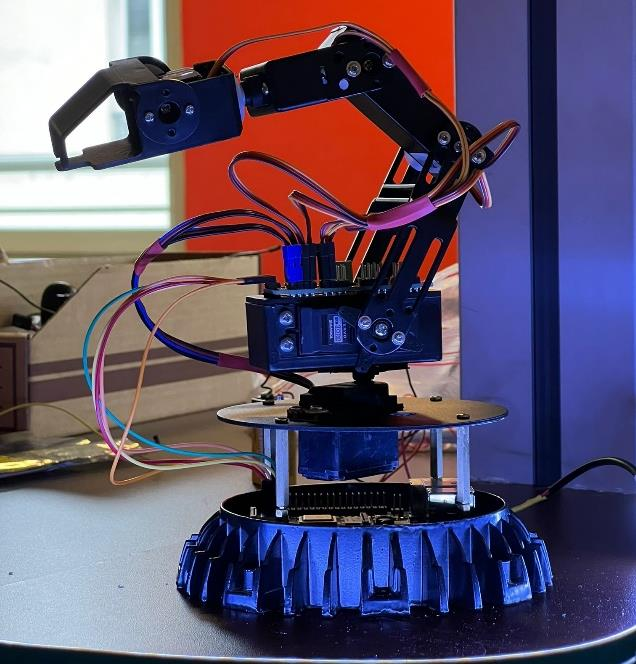

# 🤖 Armistice - Teleoperated Medical Robotic Arm


**Assisting medical professionals in disaster and conflict zones via remote control and AI-powered vision.**

---

## 📝 Overview
**Armistice** is a 6-axis, teleoperated robotic arm specifically designed to demonstrate the feasibility of remote medical intervention in areas impacted by natural disasters or active conflict. By coupling robust mechatronics with an AI-equipped vision system, a surgeon or doctor can interact with the environment, run diagnostics, and deliver critical care from a secure location while the robot operates in the danger zone.

## 🛠️ Hardware Components

The resilience and precision of the robot are achieved through a carefully selected set of components:

| Component | Model & Spec | Purpose & Utility | Photo |
| :--- | :--- | :--- | :--- |
| **Microcontroller** | **Raspberry Pi 4B+** (Quad-Core) | Acts as the "brain". It processes the AI Python scripts, handles inverse kinematics math, outputs PWM logic, and hosts the visual interface. |  |
| **PWM Driver** | **PCA9685** (16-channel I2C) | Offloads the exact PWM signal generation from the Pi to ensure jitter-free, millimetric precision for all 6 axes simultaneously. |  |
| **Servo Motors** | **DS3218 Pro** (20, 25 & 30 kg/cm) | Replaced standard hobby servos with full-metal gear high-torque servos to lift heavier medical tools and maintain extreme stability. |  |
| **Control Display** | **Freemove 5" Touchscreen** | V2 User Interface. Displays the live camera feed and allows touch-based, real-time control of the servos. |  |

<br/>

## 🕹️ Interface & Features

The user interaction revolves around a central Graphical User Interface (GUI) engineered to give operators absolute control over the robot while keeping maximum contextual awareness.

<div align="center">
  
</div>

### 🌟 Key Features:
- **Live Camera Feed**: The interface embeds the live Microsoft 720p webcam feed so the operator can see exactly what the robotic gripper is pointing at.
- **Angle Control Sliders**: Every single servo motor (Base, Shoulder, Elbow, Wrist Pitch, Wrist Roll, Gripper) has a dedicated slider mapping the precise degree angle in real time.
- **Autonomous Target Recognition**: With a click of a button, the system can switch to AI tracking mode, where it identifies specific target colors/shapes and moves the IK-target automatically to reach that object.
- **Dual-Control Support**: While the Touchscreen UI offers precise slider adjustments, the system fully supports a **PlayStation 4 DualShock 4** controller (via `ds4drv` library) for intuitive, joystick-based analog movement.

## 📐 Inverse Kinematics (IK) & Simulation

To move the robotic arm predictably, the system does not simply guess joint angles. Instead, it uses **Inverse Kinematics (IK)** to calculate exactly how each joint must bend to place the end-effector (the gripper) at a precise `[X, Y, Z]` Cartesian coordinate in 3D space.

<div align="center">
  
</div>

### How it works:
1. **Targeting (`X, Y, Z`)**: The user (or the AI) specifies a coordinate point in space.
2. **Mathematical Resolver**: The custom Python algorithm uses trigonometric functions (`math.atan`, `math.acos`) to compute the base rotation (`Delta`) and the respective joint angles (`Theta 1`, `Theta 2`, `Theta 3`).
3. **Safety Constraints**: The IK engine automatically avoids impossible geometries or self-collision by mirroring angles and limiting absolute rotation boundaries.

**Kinematic Blueprint:**
<div align="center">
  
</div>

*(Multiple numerical simulations within Python were successfully executed and validated before porting the math to the physical PCA9685 driver, ensuring the arm moves flawlessly in a smooth, non-linear trajectory.)*

---

## 🤖 The Complete Robot

Combining all the mechatronics, logic, and interface software yields the fully functional **V2 Armistice Robot**, capable of remote medical intervention and automated tracking.

<div align="center">
  
  
</div>

## 📁 Repository Structure
```
armistice-github-repo/
├── src/
│   ├── ERA.py               # Inverse Kinematics mathematical engine
│   ├── main.py              # Main execution loop
│   ├── test_interface.py    # Touchscreen GUI Integration (Servomoteur/Camera)
│   ├── brouillon.py         # Sandbox & early prototype logic
│   └── kinematics.py        # Forward/Inverse Kinematics implementation
├── media/                   # Assets, demonstration videos, GUI & hardware photos
└── README.md
```

## 🚀 Impact & Future Scope
The initial prototype proves that a low-cost (~150-300€), highly capable medical support robot can be deployed with minimal infrastructure. Future iterations could integrate fiber-optic connections for zero-latency transatlantic surgery and advanced haptic feedback for the operator.

---
*Created by Groupe 4: Grégoire BOULEY, Julien LE-BRIS, Alan MOREAU, Arthur SOGHOYAN*
